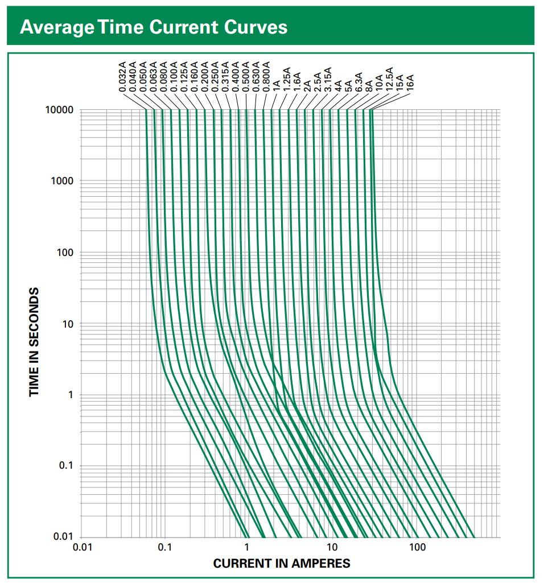
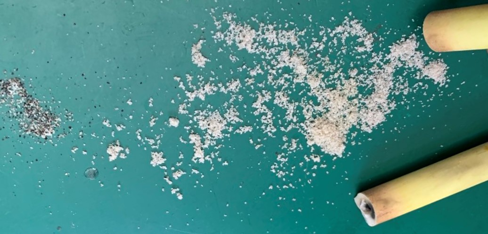
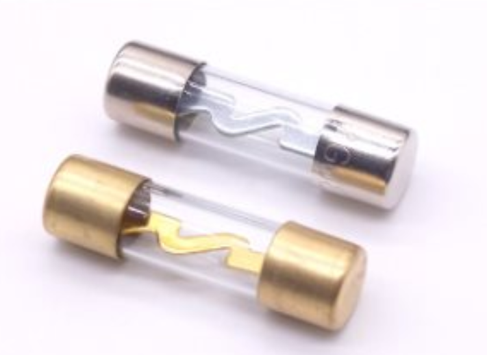
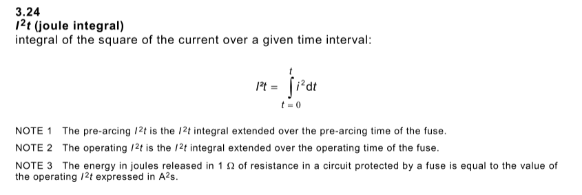
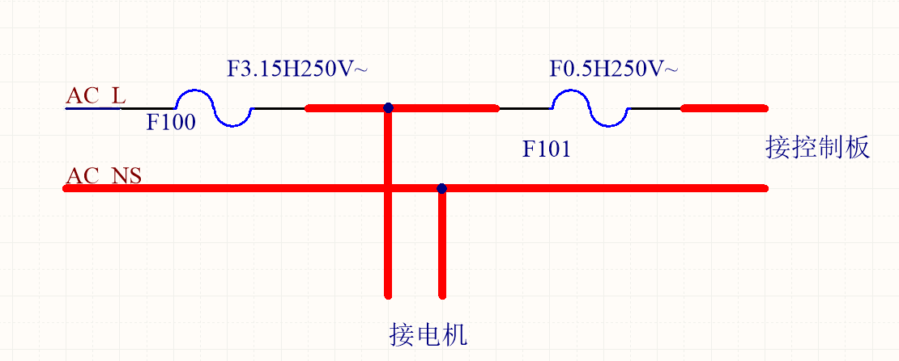

# 保险丝

保险丝（fuses，也称为熔断器），看似简单，但感觉也是特别多细节的器件，且，这些细节都还很重要（保护器件，自然重要）。

以下为熔断器熔断的四个工作过程：1、正常导通；2、熔化（弧前）；3、燃弧（保险丝金属丝本体虽然已经熔断，但尚存拉弧，一般而言电压越高，拉弧越严重）；4、熔断（完全熔断隔离）。

常见保险丝的丝印上都标注了哪些信息？

答：  
如：F3.15H250V~

1. F：熔断速度等级。F：代表快分断；T：代表延时分断（因为延时，从而对浪涌耐受较高）；
2. 3.15：额定电流；
3. H：电流分断能力。H：高分断能力；E：增强分断能力；L：低分断能力；
4. 250V~：250V：额定电压； ~：交流（与直流区分）。

**上面这几个都是最重要的参数，一定要跟实际使用场景匹配。**

其他规格性能参数，参考[Selecting Fuses: Simple Procedures to Get the Right Overcurrent Protection for DC-DC Converters](https://www.powerelectronics.com/technologies/passive-components/article/21863300/selecting-fuses-simple-procedures-to-get-the-right-overcurrent-protection-for-dcdc-converters)

1. Temperature Derating：温度降额
2. Melting Integral ($$I^2t$$)：焦耳积分
3. Maximum Circuit Fault Current：电路最大短路电流
4. Required Agency Approvals：安规认证
5. Mechanical Considerations：机械方面的考虑
6. ...

## 熔断速度

**熔断速度是与额定电流和工作电流有较强关联的一个参数，要和下文额定电流部分结合来看**。

下面直接抄自Littelfuse公司的保险丝规格书（尚未在IEC 60127中逐一确认）：

This part of IEC 60127-4 covers both PCB through-hole and surface mount fuses. This standard covers fuses rated 32, 63, 125, and 250 volts. This standard will be accepted by UL/CSA making it the first global fuse standard. This specification uses different fusing gates than IEC 60127-2; the gates used here are *125%, 200%, and 1000%*.

The fuses must not open in less than one hour at 125% of rated current and open within two minutes at 200% of rated current.  
The 1000% overload is used to determine the fuse characteristic. The opening time for each rating is listed below.（10倍额定电流的熔断时间）

- Type FF : Less than 0.001 sec.
- Type F : From 0.001 - 0.01 sec.
- Type T : From 0.01 - 0.1 sec.
- Type TT : From 0.1 - 1.00 sec.

These characteristics correlate to the terminology used in IEC 60127-1.

差不多一个速度等级对应一个时间数量级。

总结就是：

1. 把控能正常的时间是1小时（不熔断），及其对应的电流；
2. 保证熔断的时间2分钟内（熔断），及其对应的电流；
3. 用1000%额定电流的熔断时间区分判定熔断速度等级；

## 额定电流

额定正常工作的电流为$$I_N$$，但正常使用时，我们一般会降额，不会真的在$$I_N$$长期运行，比如额定电流比实际电流大20%-50%。

关于实际熔断的电流，很明显，跟时间是有很强的关联的，根据上文**熔断速度部分**摘抄自Littelfuse公司的保险丝规格书的说法，IEC 60127-4把控3个电流阈值，分别为额定电流的125%, 200%, and 1000%

- 125%：1小时不熔断（那就是基本不会熔断）；
- 200%：2分钟内熔断；
- 1000%：根据快关断和慢关断等级区分分断所需要的时间（见上文熔断速度）

保险丝熔断时间-电流曲线，如下是Littelfuse一规格书中画出的保险丝熔断时间-电流曲线：

提问：上图曲线所描述的保险丝是的速度是哪个等级？

答：以0.032A的保险丝为例，在电流为$$1000\%*I_N = 0.32A$$时，熔断时间约等于0.2s（看起来稍大于0.2s），那么其熔断速度等级应该因为TT（Type TT : From 0.1 - 1.00 sec），正好与Littelfuse对该系列的保险丝的命名Time-Lag Fuse对应。

## 电流分断能力

根据国标GBT 9364.2 （见附录GBT 9364可以理解为 IEC 60127的中文版），小型熔断器

在标准规格单中查看测试分断能力的标准（表单中的保险丝额定电流范围：32mA~10A）。

- 高分断能力-H：1500Aac
- 增强分断能力-E：150Aac（for 5mm × 20mm），200Aac（for 6.3mm × 32mm）
- 低分断能力-L：35A或者$$10I_N$$中，取较大者

疑问：

- [ ] 是否因为电流太大，导致保险丝内部熔断拉弧时，内部发热量大，金属气化严重，一直拉弧导电，不易断开？之前用的小型盒装的低分断能力保险丝，就因为分断能力太差，然后在很高电流的短路状态下，拉弧数秒不灭弧，可能会导致PCB板铜箔熔断，火花四溅的风险。

## 额定电压值

保险丝熔断后，因为两端电压的存在，内部是会拉弧的，如果保险丝熔断后，长时间拉弧，电气不能完全断开，将会是非常危险的，这就涉及到电压的分断能力。The rule of thumb，耐压越高，保险丝本体越长(同时，直流电压比起交流电压的会更长)。

### 交流和直流

保险丝是分交流和直流的，一般而言，同一个保险丝对交流的分断能力要好于对直流的分断能力。

交流电呈正弦波形交替传导，每周波有一个过零点，此时电量值最低很容易熄灭电弧；而直流电的任何波形都不存在过零点，在开断直流短路故障电流时，**全靠熔断片的迅速汽化和石英砂的扩散吸附和冷却作用强迫熄灭电弧**，因此要比开断交流电弧困难得多。

**直流快速熔断器能替代交流快速熔断器，反之不可以。**（见elecfans这篇文章《[直流保险丝与交流保险丝的区别](http://www.elecfans.com/yuanqijian/baoxiansi/20180829745893.html)》）

When an AC fuse blows, it will only open the circuit a few millimeters as that is all that is necessary. If you use an AC fuse with DC current and the circuit is opened (fuse blows), one of three things will happen:

1. The gap made by the open fuse will be too small and the DC current will jump across, get hot and melt (fuse) the metals back together. This is very dangerous as the condition that caused the fuse to blow or breaker to trip is still there. Now the wiring will heat up and eventuall                               y catch fire.
2. The gap made by the open fuse will be too small and the DC current will arc continuously until it has melted everything around it and/or caught your home on fire.
3. The gap will arc and melt until the gap opens far enough to extinguish the arc (spark). Although this is physically possible, I have never seen it.
DC CIRCUITS MUST BE OPENED FAST AND FAR ENOUGH TO EXTINGUISH (GET RID OF) THE ARC!

**THIS IS EXACTLY WHAT A DC FUSE DOES! IT OPENS THE CIRCUIT FAST AND FURIOUS TO PROTECT YOUR VALUABLES!**（见网站：[USING AN AC FUSE IN A DC SYSTEM IS EXTREMELY DANGEROUS!](http://solarhomestead.com/difference-between-ac-and-dc-fuses/)）

### 高压保险丝

除了单纯增加保险丝长度，高压保险丝还会有另一些技术，用于灭弧：

1. 填充石英砂，电弧在石英砂填料强迫冷却的作用下，自行迅速熄灭进行开断；
   
2. 使用弹簧，保险丝熔断前，弹簧连接保险丝并处于拉伸状态，在保险丝熔断时，弹簧自动缩回，增加保险丝熔断处拉弧的长度，达到灭弧的效果；
   

注意：

使用弹簧的保险丝，在缓慢熔断的时候，弹簧会因为高温而丧失弹性：

疑问：

- [ ] 小电流用弹簧，大功率用片状加石英砂，为何？
- [ ] 熔片折弯是什么操作？
  疑问来自百度知道的一个回答，它说对熔片进行折弯<https://zhidao.baidu.com/question/347477121.html>
  从网络上找到的这样的折弯，如下图：
  

- [ ] 若是将DC保险丝用于AC，请问可以使用的AC电压是DC的几倍？（**其实这个问题才是我最关心的**）
  - 百度知道“[AC用和DC用保险丝的差别？如果不考虑其熔断时间和电流特性，是否可以互相替换？有没有危险？](https://zhidao.baidu.com/question/347477121.html)”里说，AC保险丝用于DC电路，需要有1.3-1.4的降压系数，原文：“*例如西门子公司的1000V AC 交流快熔，限定用在440V DC 回路，法国罗兰的交流700V熔断器，用于直流时也遵循1.3－－1.4的降压系数，只用在500V DC 的回路，这是国际电工业界公认的一个安全准则*”。也就是说西门子公司交流用到的电压时直流的2.27倍，但法国罗兰只是用到了1.4倍。
  - quora 问答 [Are AC and DC fuses the same](https://www.quora.com/Are-AC-and-DC-fuses-the-same) 原文“*So that’s why you might and will see fuses rated 120/220 AC, 24DC. A much lower rating for DC than for AC*.”这里DC到AC，电压为10倍。
  - 以类似的继电器为例，宏发股份的HF3FF继电器，其安规认证的交流直流为：250Vac/28Vdc，电压倍数为：8.9倍。
  - 看常用的AC保险丝的安规证书，是否像继电器一样有交流和直流，但是，很失望没有找到。

因此，直流高压保险丝的要求将会比交流高保险丝高出很多，因为DC要更难分断。

另外， 为什么说太阳能电池板输出的DC电，会更糟糕？见：[Dangerous Substandard PV Systems](http://s4solar.co.nz/information/video/dangerous_substandard_pv_systems/)

下面是一家做太阳能连接件和保险丝的公司：NSPV新金阳光电科技有限公司 : [NewSun PV Technology Co.,Ltd 网址](http://www.new-pv.com/)以及它的[NSPV-连接器的网址](http://www.solarinlinefuse.com/)

保险丝如下图：

## 温度降额

保险丝所处的温度越高，散热将会越慢（温度梯度越小）。在保险丝融化温度固定的情况下，环温越高，允许的工作电流越小。

疑问：

- [ ] 电流降额使用时，有没有简单的降额评估公式，应当降额多少，包括环境温度和使用电流波动范围等，如何简单画一条降额曲线？

## $$I^2t$$值

$$I^2t$$即焦耳积分（joule integral），是积分，不是简单的乘积，是短路电流状况下较精确选择熔断器的依据（0.1s熔断时间或者弧前时间0.01s以下）在通过大电流，弧前时间10ms以下，熔断器弧前$$I^2t$$和熔断器结构和设计有关，而熔断$$I^2t$$不仅和熔断器结构和设计有关，和线路电压及电路的参数直接有关。

定义公式如下图：

测试时间标准：

- 弧前时间在10ms以内，对于50Hz的交流电来说，正好是半个周期，若是电源上电的浪涌（给电容充电），不管在哪个交流相位上电，过了半个周期（10ms），电流会降下来的了。
- 熔断时间在0.1s以内

$$I^2t$$关联参数知识：

a) 过载分断时由于散热，弧前时间很大，$$I^2t$$极大，数据几乎没有价值，这时采用时间-电流特性选用熔断器和做配合；

b) 对于要保护设备和器件，按照$$I^2t$$选择熔断器的依据是：熔断器的熔断$$I^2t$$小于受保护设备和器件 ,设计常约留10%冗余；（**这是我抄来的，但我觉得10%余量太小了。[知乎-熔断器常见指标$$I^2t$$特性](https://zhuanlan.zhihu.com/p/181559546)**）

c) 级间配合原则：不动作的器件弧前$$I^2t$$ ，大于动作熔断器的熔断$$I^2t$$。  
根据下图来做通俗的解释，若是我们希望控制板短路时，F101熔断，而F100不动作，那么在F101进入完全熔断（已经灭弧）之前，F100不能开始熔断，也就是：F101熔断$$I^2t$$（包括弧前以及熔断时的拉弧部分）=F100实际经历$$I^2t$$＜F100弧前$$I^2t$$。这样，F100没有任何动作。

d) 开机浪涌电流

AC整流电路如下：

整流电路开机瞬间，电容的充电导致的浪涌电流如下：

图中，电流绝对值达到132A，是非常大的。为了降低开机浪涌电流，可以在电路中串联功率NTC热敏电阻（为什么不用PTC或者定值功率电阻，且听下回分解）。

另外，和保险丝一起承受开机浪涌电流的还有热敏电阻、整流二极管等，也是需要把控其可靠性的，不可在连续开关机的过程中损坏。

**疑问：**

为何一般看到的这种整流管（见AC整流电路图），$$I^2t$$标定的时间一般是8.3ms呢，而不是10ms？

随意找一个`GBJ25005-Diodes`，查看其规格书，得到如下：

想来，8.3ms是60Hz的半波时长，在有些地区，是适用的，而且，用于把控器件的可靠性，8.3ms比10ms要更加严苛，因此，其实用8.3ms更加合理。

## 安规认证

保险丝对电气的安全影响较大，因此，有较多成文的法律法规，规定不同场合下的保险丝需要达到的规格性能，以及相应的测试规范。

附录B有列举一些IEC和GBT专门规定保险丝（熔断器）的标准规范。

## 其他断路开关

### 断路器

### 空气开关

空气开关，又名空气断路器，是断路器的一种。

### 自恢复保险丝

什么材料，什么原理？

原理？

## 总结

看了一圈GBT和IEC，以及网上的言论，最终决定，还是要看具体使用场景测试。

1. **保证安全**，熔断后最好不要烧穿保险丝本体，不要产生火苗，不要把玻璃爆得满地都是。
2. 该正常运行就正常运行，不该熔断的时候不熔断
   - 正常浪涌电流下，不熔断；
   - 环境温度太高，需要考虑降额，防止熔断；
   - 产生故障时，电流能快速熔断保险丝。

3. 该熔断时，能做到快速熔断
   - 电流分断能力
   - 电压分断能力：
        - 电压太高会导致长时间的拉弧，不易熔断；
        - 直流电比交流电更不容易灭弧，也就更不易达到完全断开的目的；

## 附录

### A 词汇翻译（自己翻译的，非标准）

1. fuse:熔断器（保险丝）
2. Voltage Rating: 额定电压
3. Current Rating： 额定电流
4. Interrupting Rating：电流分断能力
5. Temperature Derating：温度降额
6. Melting Integral ($$I^2t$$)：焦耳积分
7. Maximum Circuit Fault Current：电路最大短路电流
8. Required Agency Approvals：安规认证
9. Mechanical Considerations：机械方面的考虑

### B 安规标准

有许多安规标注是关于熔断器的（保险丝）

- IEC 60127 / GBT 9364 Miniature fuses 小型熔断器
- IEC 60269 / GBT 13539  Low-voltage fuses 低压熔断器；
- IEC 60282 / GBT 15166  High-voltage alternating-current fuses  高压交流熔断器 （针对50Hz的）
- IEC 60644 Specification for high-voltage fuse-links for motor circuit applications
- IEC 60549 High-voltage fuses for external protection of power capacitors
